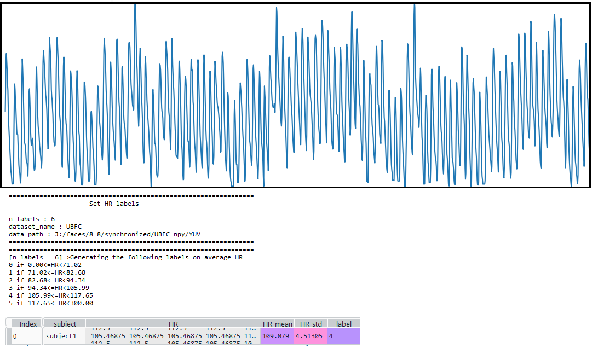
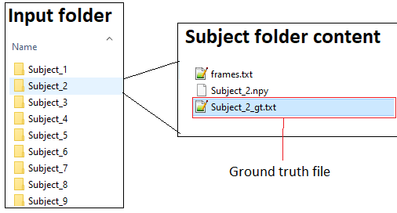

# Codebase for adding labels based on HR to BVP signals 
- HR: Heart rate
- BVP: Blood volume pulse



## Explanation

This script takes one RPPG dataset and asign a label to each subject based on the average HR measured on a Blood volume pulse signal.
with a 15-second sliding window step=0.5.
It works for pre-processed databases where the ground truth is grouped as follows:

```sh
.../<subject1>/<subject1>_gt.txt
.../<subject2>/<subject2>_gt.txt
...
.../<subjectN>/<subjectN>_gt.txt
```

i.e. Subjects are separated by folder and the BVP file has the same name of the subject's folder. The BVP file should finished by '_gt.txt', e.g. ```'<subjectX>_gt.txt'```.



The output is a pandas dataframe saved in pickle format with the name of each subject followed by the HR vector measured on the BVP, the average of that HR vector and the std. Finally a label related with the HR values.


## Acknowledgments

- The detect_peaks function was taken from the following repository: https://github.com/demotu/BMC/blob/master/functions/detect_peaks.py


